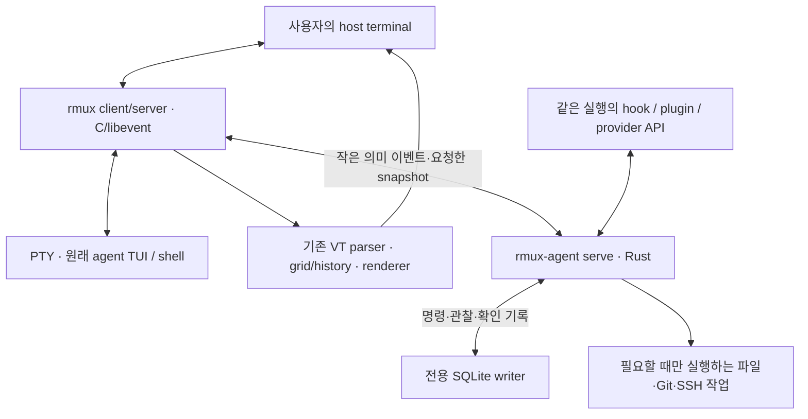

# rmux 성능 중심 아키텍처

상태: 2026-09-28 설계 선택. 사용자가 언어·기술 스택 선정을 위임한 조건에서 선택했다. 이후 터미널 코어와 읽기 전용 관찰 IPC를 구현했다. [실제 구현 범위](implementation-status.md)와 [검증 기록](validation/2026-09-28-core.md)을 별도로 관리한다. 이 문서의 agentd·저장·관리 설계와 예산은 여전히 구현 및 검증 목표다.

## 1. 선택

**tmux C/libevent 코어를 작은 patch 집합으로 확장하고, 에이전트 제어·관찰·저장은 필요할 때 시작하는 Rust 프로세스로 분리한다.**

- `rmux`: pinned tmux fork의 native client/server. PTY, key table, VT parser, grid/history, layout, terminal 출력과 tmux 명령을 소유한다.
- `rmux-agent`: 하나의 Rust 실행 파일. CLI 요청, hook 보고, 그리고 `serve` 역할의 장기 실행 관리 프로세스로 사용한다. 이후 문서에서는 장기 실행 역할을 agentd라고 부른다.
- 에이전트 프로그램은 기존 설치본을 그대로 PTY에서 실행한다. provider마다 별도의 rmux 터미널 parser나 rendering runtime을 만들지 않는다.
- agentd가 없거나 정지해도 tmux 기능과 원래 agent TUI 입출력은 유지된다. 추가 상태는 stale/unknown으로 바뀌고 추가 제어는 명시적으로 거절하거나 대기 상태를 보여 준다.

### 선택한 스택

| 역할 | 선택 | 이유와 제한 |
| --- | --- | --- |
| 터미널 코어 | upstream tmux의 C, libevent, terminfo/ncurses, 기존 OS 지원층 | 전체 tmux 기능과 입력·화면 의미를 재구현하지 않고 유지 |
| 터미널 엔진 | tmux의 기존 VT parser, screen/grid/history, render 경로 | 원래 byte stream을 한 번만 해석. Ghostty VT나 별도 terminal core를 중첩하지 않음 |
| 에이전트 관리 | stable Rust, Tokio current-thread runtime | 네트워크·timer·IPC 상태를 한 owner에서 조정. GC와 CPU 수만큼의 worker 생성 없음 |
| 영속 기록 | rusqlite + 고정 SQLite, WAL, synchronous=FULL, 전용 writer thread | 중요한 요청의 접수·dispatch 경계·사용자 확인을 transaction으로 보존. keystroke 경로에서 분리 |
| 내부 control IPC | Unix stream socket, 길이 제한 frame, C yyjson / Rust serde_json | 저빈도 의미 이벤트만 전달. 고정 pool·depth·중복 key 검증. C/Rust 공유 heap 없음 |
| 제공자 연결 | 재사용하는 hook/plugin socket 또는 동일 native session의 HTTP/SSE 등 | 토큰별 새 프로세스·full transcript 동기화·두 번째 headless engine을 만들지 않음 |
| 공통 UI | tmux의 menu/mode와 cached metadata | 기본 status/key 동작을 유지. 새 UI는 사용자가 열 때 동작하고 지속 animation을 두지 않음 |
| 원격 | 기존 OpenSSH + 원격 native rmux attach, 필요한 경우 별도 metadata bridge | 원래 터미널 경로를 Rust/JSON으로 relay하지 않음. 조회가 원격 server를 재시작하지 않음 |
| 빌드 | tmux build 유지 + 별도 Cargo build | 하나의 언어로 통합하기 위한 전면 재작성보다 upstream 비교와 변경 격리가 우선 |

구체적인 crate/library version은 구현을 시작할 때 official source와 지원 OS에서 확인해 고정한다. 기존 소스의 version과 새로 선택할 dependency version을 혼동하지 않는다.

## 2. 이 구조를 선택한 이유

전체 tmux 호환을 요구하면서 parser·key mode·format·hook·control protocol·layout을 새로 만드는 비용은 언어 선택의 작은 이득보다 크다. 또한 에이전트 관리 때문에 raw output을 다른 프로세스로 옮겨 다시 parse하면 byte 수와 pane 수에 비례한 일이 중복된다.

| 대안 | 이점 | 이번 선택에서의 판단 |
| --- | --- | --- |
| upstream tmux를 그대로 실행하고 control mode만 사용하는 wrapper | fork 유지 부담이 가장 작음 | 초기 비교 prototype으로 유지. 원래 grid의 제한된 snapshot, 정확한 실행 generation, UI/수명 신호를 저비용으로 얻는 데 한계가 있어 최종 기본 구조로 선택하지 않음 |
| tmux C 코어에 에이전트 기능 전체 구현 | 프로세스 간 복사 감소 | provider 오류·JSON/HTTP·DB·장시간 작업이 terminal event loop와 결합. 단일 프로세스의 작은 RSS만으로 판단하지 않음 |
| tmux C 코어 + Rust agentd | native terminal 경로 보존, 추가 기능의 수명·자원 격리 | 선택. 프로세스와 IPC 비용을 추가하지만 terminal bytes를 보내지 않고 agentd를 지연 시작하여 제한 |
| Rust 또는 다른 언어로 독립 mux 구현 | 내부 설계를 처음부터 통일 가능 | 전체 tmux 동작 재현·장기 drift 비용이 큼. 측정 근거 없이 더 빠르다고 가정하지 않음 |
| Herdr 기반 fork | agent 기능과 PTY 관리가 이미 존재 | tmux 전체 공개 동작과 기본값을 가져오는 일이 별도로 남음 |
| Web/Electron UI 또는 에이전트 transcript 재렌더링 | 풍부한 별도 UI | 원래 TUI 보존과 가벼운 터미널 도구라는 현재 목표에 맞지 않음 |

stock wrapper 비교가 같은 계약과 성능을 더 작은 변경으로 충족한다면 core patch를 줄인다. 설계의 목적은 fork 자체가 아니라 중복 처리와 호환 재구현을 피하는 것이다.

## 3. 데이터 흐름

도식의 rmux client/server는 upstream의 실제 tty 소유권을 그대로 따른다. 새 client renderer를 추가한다는 뜻이 아니다. core가 client terminal로 출력한 사실과 host terminal이 물리 화면에 그렸다는 사실도 구분한다.

### 입력 경로

host terminal → 기존 tty key 해석 → 기존 prefix/mode/table 처리 → 기존 PTY write다. 이 경로에는 agentd RPC, SQLite transaction, provider 상태 조회, prompt 전체 logging, 추가 terminal parser를 넣지 않는다.

### 출력 경로

PTY → 기존 parser/grid → 기존 incremental output 또는 redraw → 관심 client의 tty다. agent 관찰용으로 모든 byte를 JSON/SSE에 복제하지 않는다. upstream이 유지하는 history와 flow control은 그대로 남는다.

### 관찰 경로

PTY parse batch 완료와 resize·reflow·reset·alternate screen 전환에서 관심 pane의 dirty generation을 갱신한다. snapshot은 관심 등록과 rate budget이 있을 때 기존 base grid의 제한된 bottom 영역을 읽는다. native lifecycle 신호가 있는 agent는 가능한 한 화면 검사를 생략한다. 이 경로의 지연·손실은 observation의 신선도와 unknown에 반영되며 PTY를 멈추지 않는다.

### 관리 요청 경로

`rmux-agent` 요청 → 대상·권한·operation ID 검증 → durable 접수 → dispatch 가능 여부 확인 → durable dispatch 의도 → 실제 효과 → 확인된 결과 기록이다. fsync 지연은 이 경로의 접수·효과 시작에만 영향을 주고 직접 typing에는 영향을 주지 않는다.

## 4. 불변식

| ID | 유지할 조건 |
| --- | --- |
| I-01 | PTY byte와 VT/history의 owner는 core 하나다. agentd는 terminal을 재구현하지 않는다. |
| I-02 | terminal hot path는 agentd·disk·provider를 기다리지 않는다. |
| I-03 | core object의 raw pointer를 IPC로 내보내지 않는다. boot ID와 object/run generation으로 재사용을 구분한다. |
| I-04 | bounded queue가 가득 차면 유형별 거절·합치기·gap을 사용한다. 조용히 drop하고 성공을 표시하지 않는다. |
| I-05 | 원래 tmux 명령·옵션·default binding·축약 해석·public control mode를 보존한다. |
| I-06 | 이름이 같은 operation의 재시도와 새 요청을 구분하고, 불확실한 외부 효과를 자동 재실행하지 않는다. |
| I-07 | 상태 관찰이 불가능해도 원래 TUI는 작동한다. unsupported와 idle을 구분한다. |
| I-08 | agentd의 thread·timer·worker 수를 logical CPU 수나 pane 수에 선형으로 늘리지 않는다. |
| I-09 | 복구·confirmation·snapshot은 대상별 결과와 확인 단계가 있다. |
| I-10 | 자원 한도를 위해 기존 tmux history·buffer·client 기능을 조용히 축소하지 않는다. 한도는 rmux 추가 처리에 적용한다. |

## 5. 호환 실행과 확장 접근

tmux의 `cmd_table`, 기본 옵션 이름 lookup, 308개 기본 binding은 upstream을 유지한다. `agent-*`를 기존 command registry에 추가하지 않는다. 기존 명령의 짧은 prefix가 새 명령 때문에 모호해지는 것을 막기 위해서다.

에이전트 명령은 별도 실행 파일 `rmux-agent`에 둔다. command prompt에서는 기존 `run-shell -b`로 접근해 helper 대기를 client 키 처리 앞에 놓지 않는다. 기본 단축키는 추가하지 않으며 사용자가 원하는 키에 이 경로를 bind할 수 있다. 실제 옵션 문법은 [protocol 문서](design/protocol.md)에 정의한 동작을 구현할 때 고정한다.

tmux를 하드코딩한 script에는 rmux 환경에서만 선택적으로 활성화하는 `tmux` 호환 진입점을 제공한다. system tmux 실행 파일을 덮어쓰지 않는다. 기본 tmux config·plugin의 동작과 `TMUX`/`TMUX_PANE`의 대상 관계를 별도 검증한다. 패키지 이름·선택한 server namespace만으로 stock tmux와 socket을 섞지 않는다.

rmux 전용 설정은 별도 agent 설정에 둔다. 추가 metadata format은 명확한 `rmux_` namespace를 사용하고 agent 확장을 켠 경우의 추가 정보임을 문서화한다. 기존 format 값이나 option abbreviation은 바꾸지 않는다.

## 6. Module과 소유권

| Module | Interface가 감추는 일 | owner |
| --- | --- | --- |
| Terminal core | tmux 명령, terminal 입력/출력, PTY와 pane/window/session 수명 | C event loop |
| Core bridge | object snapshot, generation 검증, bounded 관찰, 기존 동작에 대한 guarded 요청 | C event loop |
| Agent coordinator | operation, native session binding, observation reducer, attention, waiter | Rust current-thread loop |
| Provider adapters | 동일 session의 report/제어 방식, capability와 오류 해석 | coordinator가 소유하는 제한된 async task |
| Durable store | transaction·receipt·ack·restore plan·retention과 disk 실패 | 전용 writer thread |
| Work executor | Git·파일·SSH 작업의 수명·진행·취소와 리소스 직렬화 | 제한된 worker/child process |

Module의 Interface는 호출 형태뿐 아니라 ordering·failure·resource limit를 포함한다. provider처럼 실제로 달라지는 부분에만 Adapter seam을 둔다. 단일 실행 경로를 감싸기만 하는 범용 framework나 runtime plugin ABI는 만들지 않는다.

## 7. 장애와 권한

agentd crash는 추가 상태·제어의 장애다. core와 원래 agent 프로세스를 종료하지 않는다. store 장애는 신규 관리 작업의 durable admission을 막지만 direct terminal 입력을 막지 않는다. core crash는 PTY 생존 실패로 다루며, 저장한 배치가 복원되더라도 이전 프로세스가 살아 있었다고 표시하지 않는다.

최초 agent 확장 범위는 server owner의 OS principal이다. native tmux의 `server-access`, readonly client, 다중 사용자 terminal 기능은 그대로 유지한다. 서로 다른 UID의 agent metadata 공유·대리 제어는 별도의 검증된 권한 경로가 준비되어야 하며 지원하지 않으면 capability로 거절한다. 같은 UID와 공유 shell은 서로 보안 격리된 사용자라고 가정하지 않는다. 자세한 경로는 [protocol](design/protocol.md)에 있다.

## 8. 목표 수치와 검증

첫 목표는 동일 tmux 대비 기본 경로의 차이를 작은 측정 오차 수준으로 제한하고, agent 기능을 켰을 때의 추가 비용을 독립적으로 설명하는 것이다. idle 0%나 절대 지연 0을 약속하지 않는다.

[성능 예산](design/performance.md)은 core 추가 메모리, agentd RSS, thread 수, queue bytes, snapshot 처리량, 입력·API 지연, 회귀 허용 범위를 함께 정의한다. 기존 tmux history나 provider 자체의 메모리를 agentd 비용에 숨기거나 반대로 제외한 수치를 제품 전체 사용량처럼 제시하지 않는다.

## 9. 상세 설계 읽기 순서

1. [실행과 Module 설계](design/runtime.md)
2. [IPC와 작업 결과 계약](design/protocol.md)
3. [상태·저장·재시작](design/state-and-recovery.md)
4. [화면·입력·에이전트 관찰](design/terminal-and-observation.md)
5. [성능 예산과 측정](design/performance.md)
6. [구현 순서와 검증](design/implementation-plan.md)
7. [기술 선택의 근거](design/sources.md)

## 10. 아직 측정으로 결정할 것

SQLite commit batch 크기, snapshot byte/시간 예산, 동적 worker 상한의 튜닝, allocator·LTO 설정은 benchmark 뒤 고정한다. 기본 구조와 스택은 이번 설계에서 선택했으며, 이런 튜닝 항목 때문에 전체 선택을 미정으로 되돌리지 않는다.

첫 proof가 깨지면 요구사항과 실패 근거를 기록하고 대안을 다시 비교한다. 느리다는 이유로 기본 tmux 기능을 제거하거나, 정확도가 낮다는 이유로 관찰을 idle로 처리하는 것은 대안이 아니다.
