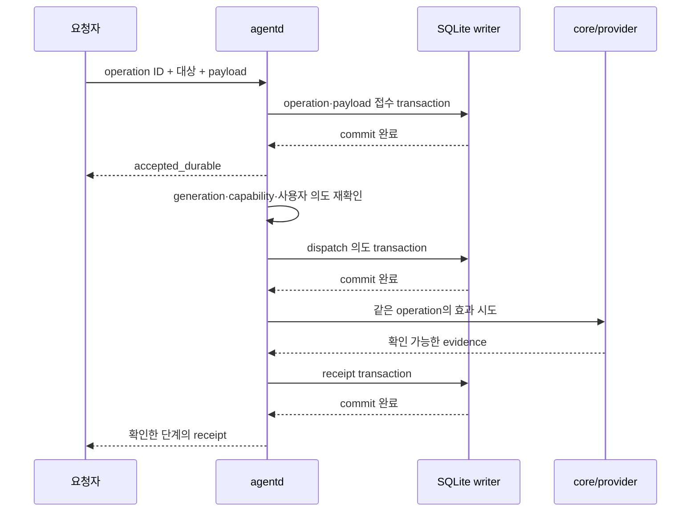

# 상태·저장·재시작

영속 저장은 관리 요청의 결과를 설명하고 작업으로 돌아오기 위해 사용한다. terminal byte stream을 event sourcing하거나 에이전트 대화 전체를 복제하지 않는다. [신뢰성 R-01~R-12](../reliability.md)의 저장·복구 구현 계약이다.

## 1. 상태의 소유권

| 상태 | 권위 있는 owner | 저장/복구 방식 |
| --- | --- | --- |
| pane/window/session, PTY, grid/history | C core | 살아 있는 core에서 조회. DB 상태로 덮어쓰지 않음 |
| provider 대화·turn·approval | 원래 provider | native ref와 확인한 사실만 저장. 원본 대화를 재구성하지 않음 |
| run binding, 최신 observation, pending waiter | agentd loop | 현재 상태는 RAM. 재시작 때 core/provider reconcile |
| operation, receipt, attention 확인, restore plan | SQLite store | 중요한 전이를 commit 후 알림 |
| client 연결·현재 view | core | client 생존 중 권위. 선택적인 view 선호는 별도 저장 |
| 원격 연결의 사용자 중지 의도 | SQLite store | reconnect scheduler가 먼저 확인 |
| 장시간 job 진행·결과 | job executor + store | job ID로 조회. process 생존 재확인 |

agentd에는 상태 변경 owner가 하나다. provider reader·DB thread·helper는 event/result만 보낸다. 여러 thread가 같은 run 상태를 mutex로 수정하지 않는다. single owner라는 이유로 parsing·파일 읽기를 무제한으로 loop에 넣지도 않는다.

## 2. SQLite 운영 결정

Rust binding은 rusqlite를 선택하고 기본 배포는 검증된 SQLite를 bundled build로 고정한다. SQLite WAL, `synchronous=FULL`, foreign keys를 켠다. writer OS thread 하나가 DB connection과 checkpoint를 소유한다. 조회도 bounded request로 이 thread를 통과하며 긴 cursor/transaction을 유지하지 않는다. 즉각적인 목록 UI는 loop의 작은 live projection에서 읽는다.

WAL의 FULL은 commit마다 WAL sync를 요청한다. 실제 전원 장애 보장은 OS/VFS/storage의 sync 이행에 달려 있다. macOS의 `fullfsync`와 `checkpoint_fullfsync` 지원·비용을 검증하고 durability profile에 기록한다. 성능 수치를 맞추기 위해 FULL을 NORMAL로 조용히 낮추지 않는다.

자동 checkpoint의 commit 지연을 피하기 위해 checkpoint를 writer의 명시적 maintenance 작업으로 예약한다. 평소 PASSIVE로 짧게 진행하고, TRUNCATE/RESTART는 admission을 제어한 maintenance 구간에서 수행한다. reader가 오래 살아 있거나 BUSY이면 상황을 보고한다. WAL을 끝없이 키우지 않고 high-water 이후 신규 durable 작업을 거절한다.

구현 시 SQLite 버전을 고정하며 WAL reset bug 수정이 포함된 버전을 사용한다. 공식 문서가 설명하는 동시 write/checkpoint 조건과 수정 범위는 [근거 문서](sources.md)에 있다. 지원 OS의 system SQLite가 오래됐다는 이유로 무검증 사용하지 않는다.

## 3. 논리 schema

아래는 migration SQL 이전의 schema 계약이다. 모든 관계는 environment 범위를 포함한다. 식별자는 원본 bytes와 표시 문자열을 구분한다. timestamp는 진단용 wall clock과 순서용 store sequence를 분리한다.

| table | 주요 column과 제약 |
| --- | --- |
| environments | id PK, owner_principal, connection_ref, desired_connection_state, intent_revision |
| core_incarnations | environment_id, core_boot_id, observed_at, ended_reason. 복구용 identity 기록 |
| workspaces | id PK, environment_id, cwd_bytes, repo_identity, worktree_identity, preparation_policy |
| agent_sessions | id PK, provider_kind, native_ref, workspace_id, capabilities_revision |
| runs | id PK, agent_session_id, boot/object/PTY/binding ref, parent_run_id, started/ended evidence |
| operation_namespaces | environment/principal, epoch, nonce, valid_until, state. 만료 namespace 재접수 금지 |
| operations | 전체 operation_key UNIQUE, action, target_ref, payload_digest, immutable dispatch_ticket, dispatch_state, outcome, revision |
| operation_payloads | operation FK, body bytes 또는 작은 attachment manifest, length, expiry. body는 bounded |
| receipts | operation FK, ordinal UNIQUE, stage, source, native_request_ref, evidence_kind, store_seq |
| attention_events | event_id PK, run/turn/request ref, reason, generation, created_store_seq, resolved_state |
| attention_acks | principal+environment+event_id UNIQUE, acknowledged_store_seq |
| restore_plans / restore_targets | plan revision, object graph, cwd identity, launch argv, native resume ref, per-stage result |
| jobs | id PK, resource_key, argv/manifest ref, progress cursor, cancellation_state, final result |
| view_preferences | principal+environment+client-profile, selected refs, optional geometry preference |

index는 active operation, run별 최근 receipt, 미확인 attention, environment별 restore target에 둔다. 모든 event의 arbitrary JSON을 index하는 범용 event store는 만들지 않는다. native provider payload는 허용한 진단 필드만 별도 bounded evidence에 넣는다.

같은 attention 사건을 확인하는 transaction은 특정 event ID만 ack한다. 동시에 새 attention이 생기면 새 event는 미확인으로 남는다. `현재 전부 읽음`은 요청 시점의 fence까지 ack하며 그 뒤 사건까지 읽은 것으로 바꾸지 않는다.

## 4. Durable admission과 외부 효과

접수 시 payload와 operation metadata를 같은 transaction에 넣는다. 본문을 저장하지 못했다면 durable acceptance도 없다. 일반 키 입력과 사용자 TUI에서 직접 입력한 prompt는 이 저장 경로를 통과하지 않는다.

짧은 batching은 여러 독립 요청을 한 transaction에 묶어 fsync를 줄인다. 최대 대기 시간과 byte 수를 제한하고, commit 전에는 batch 속 요청 어느 것도 durable 성공으로 알리지 않는다. transaction 안에서 provider/core의 응답을 기다리지 않는다.

## 5. Crash 구간별 처리

| 중단 지점 | 재시작 후 판정 | 자동 효과 재시도 |
| --- | --- | --- |
| admission commit 전 | 접수 기록 없음. 요청자는 namespace/key로 재조회 | 같은 key의 새 admission만 가능. 이전 dispatch가 없다는 근거 필요 |
| accepted 후, dispatch 의도 전 | durable pending, 외부 효과 시도 전 | 기본 보류. 대상·capability·사용자 재개 의도를 재확인한 뒤 같은 operation으로 진행 |
| dispatch 의도 후, 실제 전송 전후 | 효과 여부 불확실한 구간 | 금지. core ledger 또는 native request ref로 reconcile |
| 외부 효과 후, receipt commit 전 | 일부 effect가 일어났을 수 있음 | 금지. 확인되지 않으면 outcome_unknown |
| receipt commit 후, 응답 전 | 같은 key로 저장 receipt 반환 | 수행하지 않음 |
| core 자체가 재시작 | 이전 PTY/process와 연결 단절 | 기존 input 재전송 금지. 새 restore 의도를 별도 생성 |

core는 효과 전에 bounded operation ledger entry를 예약하고 동일 operation을 두 번 적용하지 않는다. slot이 없으면 효과 전에 거절한다. entry는 전체 operation_key, dispatch_ticket, 대상 generation, payload digest, 적용 단계만 가진다. 전체 key는 environment·principal·namespace epoch/nonce·operation ID이며 DB·staging·core·receipt에서 같다.

ledger 회수는 다음 순서를 따른다.

1. core는 연결마다 새 dispatch connection epoch와 sequence 0을 발급한다. agentd는 다음 sequence의 ticket을 dispatch 의도와 함께 DB에 고정한 뒤 effect를 요청한다. effect attempt의 ticket을 재시도 때 바꾸지 않는다.
2. core는 해당 epoch의 다음 sequence만 새 요청으로 소비한다. 이미 소비한 sequence는 entry가 남았으면 같은 key/digest인지 확인해 결과를 반환하고, 없으면 `receipt_not_retained`로 거절한다. 미래 sequence의 gap은 오류다. capacity 등 효과 전 거절도 sequence를 소비하므로 그 응답 유실이 새 실행으로 바뀌지 않는다.
3. agentd가 core의 적용 결과를 durable receipt로 commit한 뒤 `retire_receipt(operation_key, dispatch_ticket, result_digest, store_revision)`을 보낸다. core는 보관 결과와 맞으면 entry를 회수한다. 전송됐다는 receipt만으로 native turn 완료를 주장하지 않는다.
4. entry가 없어져도 현재 epoch의 consumed watermark는 남는다. 회수한 과거 sequence가 다시 오면 재실행하지 않는다. 새 연결은 새 epoch를 받고 이전 epoch의 effect 요청은 모두 거절한다. 남아 있는 이전 entry는 결과 조회·retire만 가능하다.
5. agentd는 durable dispatch intent가 있는 operation에 새 ticket을 발급하지 않는다. trusted coordinator의 이 불변식과 core의 epoch/sequence fencing을 함께 검증한다. 같은 UID의 임의 coordinator가 protocol을 고의로 위반하는 상황을 별도 권한 격리로 주장하지 않는다.

이 절차로 완료 effect 수가 lifetime 2,048회로 제한되는 것을 피한다. crash로 retire가 누락됐으면 DB와 대조해 회수한다. 증거를 찾을 수 없는 entry는 제한된 공간에 남기며, quota를 넘으면 관리 action을 거절한다. 불확실한 기록을 공간 확보 목적으로 삭제해 실행 가능 상태로 돌리지 않는다.

agentd 재접속 때 살아 있는 core의 ledger를 조회할 수 있다. entry가 없다는 사실만으로 미실행을 증명하지 않는다. 이전 connection epoch의 불확실한 dispatch를 새 epoch에서 다시 실행하지 않는다. core crash로 ledger가 사라져도 DB의 dispatch intent가 남아 자동 중복을 차단한다. 이 구조는 외부 provider까지 exactly-once 실행을 보장하지 않는다.

만료 idempotency 기록을 지운 뒤 같은 UUID를 새 요청으로 받지 않도록 server가 operation namespace를 발급한다. namespace에는 environment/principal, 증가하는 epoch와 random nonce, 유효 기한이 있다. 닫힌 epoch는 재접수하지 않고 `receipt_expired`를 반환한다. 활성 epoch의 dedup 기록은 지우지 않는다. active quota가 차면 namespace를 무한히 만들기보다 신규 admission을 제한한다. 오래된 개별 tombstone을 무한 보관하는 방식은 사용하지 않는다.

## 6. Store queue와 장애

writer queue는 byte와 request 수 모두 제한한다. important admission/receipt/ack와 maintenance를 분리하고, maintenance가 important queue를 굶기지 않도록 작은 작업으로 쪼갠다. 중요 작업이 계속 밀리면 신규 action을 거절한다. UI 조회 때문에 core를 기다리게 하지 않는다.

디스크 full, sync 실패, corruption, readonly filesystem은 서로 다른 오류다. commit 결과가 불확실하면 실패 후 재전송 가능 상태로 되돌리지 않는다. 재접속 후 DB와 effect를 조정할 때까지 해당 operation을 잠근다. DB 장애 중 direct TUI는 계속 동작하고, 추가 관리 제어는 `store_unavailable`로 거절한다.

DB stall로 timeout이 나도 writer thread를 강제 kill하거나 같은 DB에 두 번째 writer를 시작하지 않는다. shutdown은 신규 admission을 멈추고 bounded drain을 시도한다. 정상 종료하지 못했으면 다음 시작에서 recovery가 필요하다고 남긴다. 사용자 agent 프로세스에는 종료 신호를 전파하지 않는다.

## 7. 저장량과 개인정보

현재 화면·토큰·full transcript는 기본 저장하지 않는다. 관리 요청으로 접수한 prompt body는 dispatch/reconcile에 필요한 동안만 저장한다. DB directory/file은 owner만 접근할 수 있게 한다. 이는 저장 시 암호화를 의미하지 않는다. 사용자에게 관리 prompt의 일시 저장 사실과 retention을 공개한다.

본문은 native acceptance 등 더 이상 재조정에 필요 없는 조건이 확인되면 삭제 대상으로 만들고 최대 retention을 둔다. outcome_unknown에서는 정한 보존 기간 동안 metadata와 최소 payload를 유지한다. 만료된 body로 자동 재실행하지 않는다. WAL·backup·filesystem 때문에 SQL DELETE가 안전 삭제를 보장하지 않음을 문서화한다.

진단 export에는 body·token·화면·argv의 비밀 값을 기본 포함하지 않는다. DB backup은 SQLite backup Interface 또는 검증된 consistent snapshot을 사용한다. live main DB 파일만 복사해 복구 가능하다고 표시하지 않는다.

retention은 [성능·저장 예산](performance.md)의 soft/high/hard watermark를 따른다. active operation·unknown outcome을 quota 때문에 성공으로 종료하지 않는다. 자동 정리가 안전하지 않으면 신규 durable 기능을 제한하고 필요한 조치를 알린다.

## 8. Agentd 재접속과 복구

1. 기존 owner lock을 확인하고 store version을 검사한다. 실패 시 core는 계속 사용 가능하다.
2. 현재 core boot와 inventory를 읽는다. DB에만 남은 run을 live로 표시하지 않는다.
3. 동일 pane·PTY·binding generation과 native session ref를 연결한다. title/cwd 유사성만으로 연결하지 않는다.
4. dispatch 의도가 남은 operation을 core/provider와 reconcile한다. 근거가 없으면 outcome_unknown이다.
5. attention을 복구하고 사용자 ack를 합친다. source gap 때문에 없어진 approval을 자동 승인하지 않는다.
6. 새로운 epoch의 live stream으로 전환한다. query는 준비 중 단계와 stale 범위를 보여 준다.

이 절차는 관찰 재접속이다. server 재시작 후의 프로세스 재생성과 다르다.

## 9. 환경 restore

restore plan은 versioned object graph와 target별 결과를 가진다. session/window link와 pane layout, workspace/cwd, launch argv, provider native session ref를 따로 보존한다. client별 화면 선호를 모든 client에 강제하지 않는다.

| 단계 | 성공 증거 | 실패 시 |
| --- | --- | --- |
| plan 검증 | schema, 환경 identity, 대상 정책 일치 | 변경 전 오류 반환 |
| layout 복원 | 새 core object mapping과 layout 적용 | 성공 대상과 실패 대상 분리 |
| cwd 준비 | child에서 directory FD·identity 확인 | 대체 경로 실행 금지 |
| process 시작 | spawn/exec 결과와 새 run ref | exec 오류·shell 초기화 지연 구분 |
| native resume | 같은 native session ref의 readiness | 새 대화 fallback 금지. 원래 ref 유지 |
| 관찰 연결 | stream/capability 확인 | TUI 실행과 observation 실패를 분리 |

core의 기존 spawn fallback은 native 명령에서 유지한다. 관리 restore는 [strict cwd child 경로](runtime.md)를 사용한다. shell/direnv/Nix 준비는 sleep 몇 초로 성공 처리하지 않는다. 지원 integration의 readiness를 기다리고 deadline이 지나면 대상별 `readiness_unconfirmed`다.

plan 실행의 기본은 사용자 명시 동작이다. 자동 restore를 설정하더라도 무엇을 재생성할지와 사용자 중지 의도를 확인한다. 오래된 prompt·approval 응답을 재생하거나 완료 불명 operation을 다시 실행하지 않는다. 다시 시작한 agent가 이전 프로세스의 연속인 것처럼 run ID를 재사용하지 않는다.

부분 실패 재시도는 이미 성공한 target의 실행을 복제하지 않는다. native ref·새 object ref·plan revision을 다시 검사한다. 실패한 대화 연결을 숨기려고 빈 새 대화를 열지 않는다.

## 10. 원격 의도와 장시간 job

원격 연결에는 `desired=connected/stopped`, intent revision, 실제 connection state를 둔다. reconnect timer는 실행 직전 revision을 검사한다. 사용자가 stop한 뒤 도착한 이전 연결 성공 응답은 desired state를 바꾸지 않는다. 인증 만료는 backoff 실패와 구분하고 인증 안내를 보여 준다.

worktree 생성·삭제·준비는 resource key별로 직렬화한다. 전체 environment mutex는 잡지 않는다. 같은 repository의 Git metadata 변경, 같은 directory 삭제 등 실제 충돌 범위를 key로 정한다.

job 취소는 `requested → acknowledged → stopped/too_late/unsupported`를 구분한다. 외부 process 종료와 자식 process 정리를 확인하고 이미 수행한 파일 변경을 취소만으로 복구했다고 표시하지 않는다. timeout은 job 포기를 뜻하지 않는다. 조회와 명시적 취소가 남는다.

rmux가 생성하고 소유권을 기록한 worktree만 관리 삭제 대상으로 삼는다. 경로 identity가 바뀌면 중단한다. symlink 교체·다른 checkout·사용자 수정 파일을 지우는 문제는 빠른 삭제보다 우선 검증한다. 긴 디렉터리 탐색은 helper에서 수행하고 pane 전환과 다른 agent 상태 조회는 계속 처리한다.
